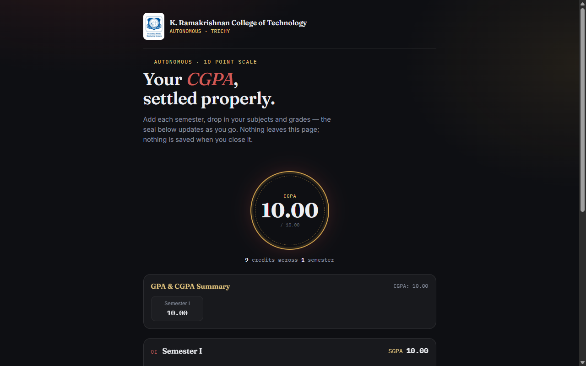

<div align="center">
  
# 🎓 CGPA Calculator & Marksheet Parser

[](https://www.gnu.org/licenses/gpl-3.0)
[]()
[]()

A smart, full-stack web application designed to automatically parse engineering college marksheets and instantly calculate your CGPA. 

**Live Demo:** [https://cgpakrct.vercel.app/](https://cgpakrct.vercel.app/)

</div>

---

<p align="center">
  
</p>

## 🚀 Overview

Calculating CGPA manually from complex marksheets can be tedious. This project solves that problem by allowing students to upload their PDF marksheets. The system intelligently extracts the subjects, credits, and grades, and computes the overall CGPA with high accuracy.

## ✨ Key Features

- **📄 PDF Parsing:** Seamlessly reads and extracts data directly from official result PDFs.
- **🤖 AI-Powered Extraction:** Utilizes AI (Gemini) to accurately identify subjects, credits, and grades even from varying marksheet formats.
- **⚡ Real-Time Calculation:** Instantly calculates the semester GPA and overall CGPA.
- **📱 Responsive UI:** Clean, modern, and mobile-friendly interface.
- **🔒 Secure Processing:** Uploads are processed in-memory for security and speed.

## 🛠️ Technology Stack

- **Frontend:** HTML5, CSS3, Vanilla JavaScript
- **Backend API:** Node.js, Express.js
- **File Handling:** Multer (for multipart/form-data)
- **AI Integration:** Google Gemini API for intelligent text extraction

## 💻 Local Development Setup

To run this project locally on your machine, follow these steps:

### Prerequisites
- [Node.js](https://nodejs.org/) installed on your computer.
- A free API key from [Google AI Studio](https://aistudio.google.com/apikey).

### Installation

1. **Clone the repository:**
   ```bash
   git clone https://github.com/dharani2006lakshmi-sys/CGPA.git
   cd CGPA
   ```

2. **Install backend dependencies:**
   ```bash
   npm install
   ```

3. **Configure Environment Variables:**
   Create a `.env` file in the root directory and add your Gemini API key:
   ```env
   GEMINI_API_KEY=your_api_key_here
   ```

4. **Start the Application:**
   Because this project uses serverless function syntax (`api/`), you can test it locally using a standard development server or the Vercel CLI.
   ```bash
   npm run dev
   ```

## 🤝 Contributing

Contributions, issues, and feature requests are welcome! Feel free to check the [issues page](../../issues). 

## 📝 License

This project is open-source and available under the [GPL-3.0 License](LICENSE).
